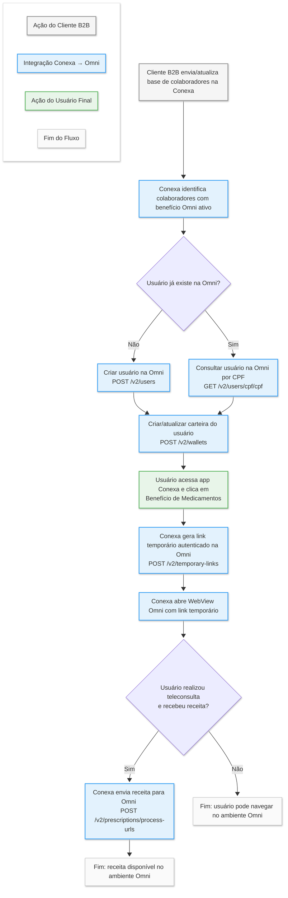

# Documentação de Integração - Conexa x Omni

## 01. Cadastro de Usuários

### Criação de Usuários
**Endpoint:** `POST /v2/users`

| Parâmetro | Tipo | Obrigatório | Descrição |
|-----------|------|-------------|-----------|
| `companyId` | string | Sim | ID da empresa |
| `name` | string | Sim | Nome completo do usuário |
| `cpf` | string | Sim | CPF do usuário |
| `dateOfBirth` | string | Sim | Data de nascimento |
| `gender` | string | Não | Gênero do usuário (MALE ou FEMALE) |
| `holderUserId` | string | Não | ID do usuário titular (para dependentes) |

**Como obter os parâmetros:**
- `companyId`: Obtido via `GET /v2/companies`
- `holderUserId`: Obtido via `GET /v2/users/cpf/{cpf}` usando o CPF do titular

**Observação importante:** O titular precisa ser criado antes dos dependentes. Quando for criar um dependente, consulte o `userId` do titular via `GET /v2/users/cpf/{cpf}` e passe esse valor no parâmetro `holderUserId` do dependente.

**Exemplo de chamada - Titular:**
```json
POST /v2/users
{
  "companyId": "a3f2b8c1-4d5e-6f7a-8b9c-0d1e2f3a4b5c",
  "name": "João da Silva",
  "cpf": "123.456.789-00",
  "dateOfBirth": "1985-03-15",
  "gender": "MALE"
}
```

**Exemplo de chamada - Dependente:**
```json
POST /v2/users
{
  "companyId": "a3f2b8c1-4d5e-6f7a-8b9c-0d1e2f3a4b5c",
  "name": "Maria da Silva",
  "cpf": "987.654.321-00",
  "dateOfBirth": "2010-07-20",
  "gender": "FEMALE",
  "holderUserId": "7b4e9f2a-3c1d-4a5b-9e8f-6d7c8a9b0e1f"
}
```

---

### Criação de Carteiras
**Endpoint:** `POST /v2/wallets`

| Parâmetro | Tipo | Obrigatório | Descrição |
|-----------|------|-------------|-----------|
| `userId` | string | Sim | ID do usuário |
| `companyId` | string | Sim | ID da empresa |
| `planId` | string | Sim | ID do plano |
| `validFrom` | string | Sim | Data de início de validade |
| `validUntil` | string | Não | Data de fim de validade |

**Como obter os parâmetros:**
- `userId`: Obtido via `GET /v2/users/cpf/{cpf}`
- `companyId` e `planId`: Obtidos via `GET /v2/companies`

**Exemplo de chamada:**
```json
POST /v2/wallets
{
  "userId": "7b4e9f2a-3c1d-4a5b-9e8f-6d7c8a9b0e1f",
  "companyId": "a3f2b8c1-4d5e-6f7a-8b9c-0d1e2f3a4b5c",
  "planId": "5d8c3a7f-2e1b-4f9a-8c6d-1a2b3c4d5e6f",
  "validFrom": "2024-01-01",
  "validUntil": "2024-12-31"
}
```

---

## 02. Link de Acesso ao Webview

### Criação do Link Temporário
**Endpoint:** `POST /v2/temporary-links`

| Parâmetro | Tipo | Obrigatório | Descrição |
|-----------|------|-------------|-----------|
| `userId` | string | Sim | ID do usuário |
| `companyId` | string | Sim | ID da empresa |

**Como obter os parâmetros:**
- `userId`: Obtido via `GET /v2/users/cpf/{cpf}`
- `companyId`: Obtido via `GET /v2/companies`

**Exemplo de chamada:**
```json
POST /v2/temporary-links
{
  "userId": "7b4e9f2a-3c1d-4a5b-9e8f-6d7c8a9b0e1f",
  "companyId": "a3f2b8c1-4d5e-6f7a-8b9c-0d1e2f3a4b5c"
}
```

---

## 03. Envio de Receitas

### Processar Receitas por URL
**Endpoint:** `POST /v2/prescriptions/process-urls`

| Parâmetro | Tipo | Obrigatório | Descrição |
|-----------|------|-------------|-----------|
| `companyId` | string | Sim | ID da empresa |
| `userId` | string | Sim | ID do usuário |
| `walletId` | string | Sim | ID da carteira |
| `prescriptions` | array | Sim | Lista de prescrições |

**Como obter os parâmetros:**
- `walletId`: Obtido via `GET /v2/users/cpf/{cpf}`

**Estrutura do array `prescriptions`:**
```json
[
  {
    "url": "https://exemplo.com/receita.pdf",
    "data": {}
  }
]
```

**Exemplo de chamada:**
```json
POST /v2/prescriptions/process-urls
{
  "companyId": "a3f2b8c1-4d5e-6f7a-8b9c-0d1e2f3a4b5c",
  "userId": "7b4e9f2a-3c1d-4a5b-9e8f-6d7c8a9b0e1f",
  "walletId": "9e3f7b2d-1a4c-5e6f-8b9a-0c1d2e3f4a5b",
  "prescriptions": [
    {
      "url": "https://storage.conexa.com/prescriptions/receita_001.pdf",
      "data": {}
    }
  ]
}
```
---

## Fluxograma da Integração


